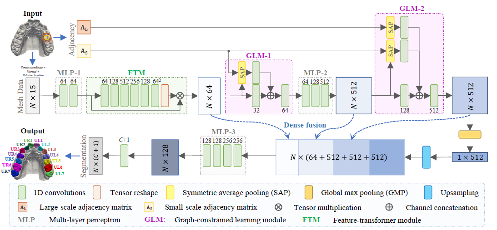

**MeshSegNet: Deep Multi-Scale Mesh Feature Learning for Automated Labeling of Raw Dental Surface from 3D Intraoral Scanners**
==============================================================================================================================

Created by [Chunfeng Lian](https://github.com/chunfenglian/), Li Wang,
[Tai-Hsien Wu](https://github.com/Tai-Hsien), Fan Wang,
Pew-Thian Yap, Ching-Chang Ko, and Dinggang Shen

Prequisites
------------
Please see requirtments.txt

Introduction
------------

This work is the pytorch implementation of **MeshSegNet**, which has been
published in *IEEE Transactions on Medical Imaging*
(<https://ieeexplore.ieee.org/abstract/document/8984309>) and *MICCAI 2019*
(<https://link.springer.com/chapter/10.1007/978-3-030-32226-7_93>). MeshSegNet
is used to precisely label teeth on digitalized 3D dental surface models
acquired by Intraoral scanners (IOSs).

In this repository, there are three main python scripts (steps 1 to 3) and three
optional python scripts (steps 3-1, 4, and 5). Unfortunately, we are unable to
provide the data. Please see below for the detailed explanation of codes.

Step 1 Data Augmentation
------------------------

In order to increase the training dataset, we first augment the available
intraoral scans (i.e., meshes) by 1) random rotation, 2) random translation, and
3) random rescaling of each mesh in reasonable ranges.

In this work, our intraoral scans are stored as VTP (VTK polygonal data) format.
To read, write, and manipulate VTP files programmingly, we use **vedo**. Please refer to
<https://github.com/marcomusy/vedo>. If you need a GUI tool to read, annotate, modify label, and save VTP files, please refer to <https://github.com/Tai-Hsien/Mesh_Labeler>.
In this work, we have 36 intraoral scans, and all of these scans have been downsampled previously. 
We use 24 scans as the training set, 6 scans as the validation set,
and keep 6 scans as the test set. For training and validation sets, each scan
(e.g., Sample\_01\_d.vtp) and its flipped (e.g., Sample\_01001\_d.vtp) are augmented
20 times. All generated augmented intraoral scans (i.e., training and validation
sets) will be saved in “*./augmentation\_vtk\_data*” folder.

In *step1\_augmentation.py*, the variable *“vtk\_path”* needs to define, which is
the folder path of intraoral scans. Then you can implement this step by the
following command.

<pre><code>python step1_augmentation.py</pre></code>

Step 2 Generate training and validation lists
---------------------------------------------

In *stpe2\_get\_list.py*, please define variables “*num\_augmentation*” and
“*num\_samples*” according to *step1\_augmentation.py.* Since we use 24 of 30
scans as training data, the “*train\_size*” is set to 0.8. You can implement this
step by the following command.

<pre><code>python step2_get_list.py</pre></code>

Then, two CSV files (i.e., train\_list.csv and val\_list.csv) are generated in the
same folder.

Step 3 Model training
---------------------

In *step3\_training.py*, please define variable “model\_name” used for
[visdom](https://github.com/facebookresearch/visdom) environment and output
filename. If your system doesn’t have
[visdom](https://github.com/facebookresearch/visdom), please set variable
“*use\_visdom*” as *False*. In this work, the number of classes is 15, second
molar to second molar (14 teeth) and gingiva. The number of features is 15,
corresponding to cell vertices (9 elements), cell normal vector (3 elements),
and the relative position (3 elements). To further augment our dataset, we
select all tooth cells (i.e., triangles) and randomly select some gingival cells
to form 6,000 cells inputs based on original scans in
“*./augmentation\_vtk\_data*” during training. To prepare the input features and
further augmented data as well as computing adjacent matrixes (AS and
AL, refer to the original paper for detail) are carried out by
*Mesh\_dataset.py*. The network architecture of **MeshSegNet** is defined in
*meshsegnet.py*.

You can start to train a **MeshSegNet** model by the following command.

<pre><code>python step3_training.py</pre></code>

We provide two trained models (an upper and a lower) and the training curves in “*./models*” folder.

Optional:

If you would like to continue to train your previous model, you can modify
*step\_3\_1\_continous\_training.py* accordingly and execute it by

<pre><code>python step3_1_continous_training.py</pre></code>

Step 4 Model testing
--------------------

Once you obtain a well-trained model, you can use *step4\_test.py* to test the
model using your test dataset. Please define the path of the test dataset
(variable “*mesh\_path*”) and filename according to your data. To implement this step, by
entering

<pre><code>python step4_test.py</pre></code>

The deployed results will be saved in “*./test*” and metrics (DSC, SEN, PPV)
will be displayed.

Step 5 Predict unseen intraoral scans
-------------------------------------

*step5\_predict.py* is very similar to *step4\_test.py*. Once you set the data
path and filename accordingly, it can predict the tooth labeling on unseen
intraoral scans. The deployed results will be saved in “*./test*” as well. No
metrics will be computed because the unseen scans do not have ground truth.

To implement this step, by entering

<pre><code>python step5_predict.py</pre></code>

Note that this step will downsample mesh if number of cells > 10,000. Otherwise most likely it will have insufficient GPU memory error.

Step 6 Predict unseen intraoral scans with post-pocessing
---------------

Our publication in *IEEE Transactions on Medical Imaging
(*<https://ieeexplore.ieee.org/abstract/document/8984309>) mentioned the
multi-label graph-cut method to refine the predicted results. To do that, by implementing
<pre><code>python step6_predict_with_post_processing_pygco.py</pre></code>

The multi-label graph cut is implemented by the python package [pygco](https://github.com/amueller/gco_python).

License
--------

The MeshSegNet code is released under MIT License (see LICENSE file for details).

Citation
--------

If you find our work useful in your research, please cite:

* C. Lian et al., "Deep Multi-Scale Mesh Feature Learning for Automated Labeling of Raw Dental Surfaces From 3D Intraoral Scanners," in IEEE Transactions on Medical Imaging, vol. 39, no. 7, pp. 2440-2450, July 2020, doi: 10.1109/TMI.2020.2971730.
* Lian C. et al. (2019) MeshSNet: Deep Multi-scale Mesh Feature Learning for End-to-End Tooth Labeling on 3D Dental Surfaces. In: Shen D. et al. (eds) Medical Image Computing and Computer Assisted Intervention – MICCAI 2019. MICCAI 2019. Lecture Notes in Computer Science, vol 11769. Springer, Cham. https://doi.org/10.1007/978-3-030-32226-7_93
* Wu TH. et al. (2021) Machine (Deep) Learning for Orthodontic CAD/CAM Technologies. In: Ko CC., Shen D., Wang L. (eds) Machine Learning in Dentistry. Springer, Cham. https://doi.org/10.1007/978-3-030-71881-7_10

